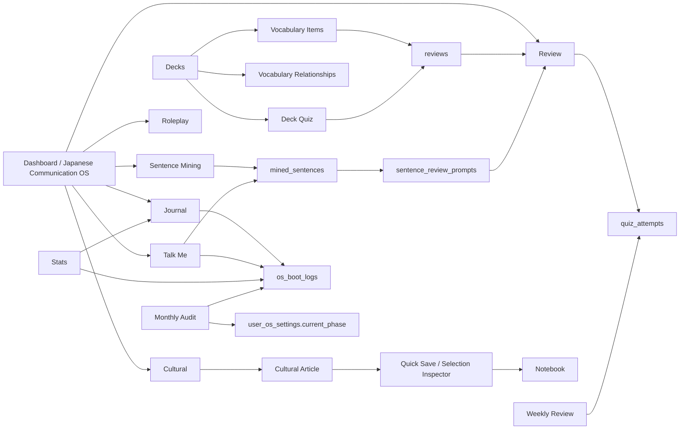

# Japan Daily Learner App Page Structure Analysis

更新日期：2026-06-04

本文整理 Japan Daily Learner 現有頁面、功能、互動方式、資料流，以及頁面之間的連動關係。分析基於：

- App Router route/source inspection
- Supabase server actions/API route inspection
- In-app Browser / Playwright authenticated DOM snapshots
- 現有 navigation、layout、client component 行為

重點不是寫 marketing 文案，而是讓開發者一眼看出：每一頁做甚麼、按鈕/表單如何運作、資料讀寫去哪裡，以及它如何連到其他學習流程。

---

## 1. Overall Structure

### 1.1 Route Groups

| Route | Type | Main Purpose | Sidebar |
|---|---:|---|---:|
| `/` | public | Landing / feature overview | No |
| `/login` | public auth | Email/password + Google login | No |
| `/signup` | public auth | Email/password + Google signup | No |
| `/dashboard` | protected | Daily command center / Japanese Communication OS | Yes |
| `/review` | protected | Mixed SRS review for vocab and mined sentences | Yes |
| `/decks` | protected | Deck list | Yes |
| `/decks/new` | protected | Manual / AI / OCR deck creation | Yes |
| `/decks/[id]` | protected | Deck detail, vocab, memory images, examples, quiz, connections | Via deck links |
| `/grammar` | protected | Grammar point capture and weekly quota | Yes |
| `/journal` | protected | Japanese output journal with AI correction | Yes |
| `/cultural` | protected | Cultural immersion hub and generated lessons | Yes |
| `/cultural/article/[id]` | protected | Cultural article reader, vocab/grammar extraction, quick save | Via cultural |
| `/mining` | protected | Sentence mining from text/media sources | Yes |
| `/talk-me` | protected | Talk Me input/shadowing session log | Yes |
| `/roleplay` | protected | Task-based AI roleplay | Yes |
| `/notebook` | protected | Personal Japanese notebook, folders, AI classification, deck import | Yes |
| `/calendar` | protected | Deck creation calendar | Yes |
| `/quizzes` | protected | Quiz attempt history and accuracy | Yes |
| `/stats` | protected | 28-day OS, output, vocab, phase stats | Yes |
| `/weekly-review` | protected | Weekly reflection and AI quiz | Yes |
| `/monthly-audit` | protected | Monthly audit and phase advancement | Yes |
| `/settings` | protected | Profile, romaji, voice, JLPT, daily word count | Yes |
| `/connections` | protected | Global vocabulary relationship index | No |
| `/professor` | protected | AI professor deep-dive chat for a selected term/sentence | No |
| `/self-talk` | protected | Self-talk stage logging | No |

### 1.2 Sidebar Navigation Groups

The protected app shell uses `APP_NAV_GROUPS`:

| Group | Routes |
|---|---|
| 今日 | `/dashboard`, `/review`, `/decks`, `/decks/new`, `/decks/new?mode=ai` |
| 練習 | `/grammar`, `/journal`, `/cultural`, `/mining`, `/talk-me`, `/roleplay`, `/notebook` |
| 節奏 | `/calendar`, `/quizzes`, `/stats`, `/weekly-review`, `/monthly-audit`, `/settings` |

Routes outside sidebar but still important:

- `/decks/[id]`: reached from deck list, calendar, vocab relationship cards.
- `/cultural/article/[id]`: reached from cultural hub / generated article.
- `/connections`: reached from connection-related affordances or direct route.
- `/professor`: reached from dashboard professor path, cultural article, and global selection inspector.
- `/self-talk`: referenced by Can-Do support routes but not currently in sidebar.

### 1.3 Protected App Shell

Protected routes share `app/(app)/layout.tsx`.

How it works:

- Checks Supabase session server-side.
- Redirects unauthenticated users to `/login`.
- Reads profile fields: `display_name`, `show_romaji`.
- Reads due review count from `reviews` where `next_review_date <= today`.
- Renders:
  - `Sidebar`
  - `TopBar`
  - `MotionShell`
  - global `SelectionInspector`

Global interactions:

- Sidebar:
  - grouped route links
  - active route state
  - desktop persistent navigation
  - logout via Supabase browser client, then redirects to `/`
- TopBar:
  - mobile nav toggle
  - search input placeholder: `搜尋單字、例句、日期或主題…`
  - streak badge
  - due count badge
  - settings link
  - logout
  - observed note: the search input is currently UI-only in inspected code; no global search submit/result flow is wired here.
- Selection Inspector:
  - active across protected content
  - user highlights text under `main`, `article`, or `section`
  - ignores form fields/contenteditable and selections over 240 chars
  - sends text/context to `/api/learning/inspect-selection`
  - displays reading, meaning, nuance, common usages, TTS, copy, save
  - save posts to `/api/learning/save-selection`
  - links to `/professor?seed=...`

### 1.4 Main Learning Loops

---

## 2. Public And Auth Pages

## `/`

Purpose:

- Public landing page explaining the app value proposition.
- Provides entry points to login and signup.

Visible structure:

- Hero with app name and positioning.
- CTA links to `/login` and `/signup`.
- Feature cards:
  - AI vocabulary generation
  - OCR import
  - Romaji support
  - Polly TTS
  - SRS
  - old/new vocabulary connections

Function behavior:

- No protected data.
- Mainly navigational.

Connected pages:

- `/login`
- `/signup`

## `/login`

Purpose:

- Existing user authentication.

Visible structure:

- Email/password form.
- Google OAuth button.
- Link to signup.

Function behavior:

- Client form uses `useActionState(signInWithEmailPassword)`.
- Server action validates email/password.
- Supabase signs in with password.
- Supports `next` query parameter.
- `safeNextPath` prevents external redirect or `//` redirect.
- On success, client redirects to `next` or `/dashboard`.
- Google OAuth uses Supabase browser client and redirects through `/auth/callback?next=...`.

Connected pages/data:

- Successful login -> `/dashboard` by default.
- Google login -> `/auth/callback`.
- Signup link -> `/signup`.

## `/signup`

Purpose:

- New user account creation.

Visible structure:

- Display name, email, password form.
- Google signup button.
- Link to login.

Function behavior:

- Password must be at least 6 chars.
- Server action calls Supabase `signUp`.
- Stores `display_name` in user metadata.
- Uses email redirect path `/auth/callback?next=/dashboard`.
- Handles email-confirmation case with an info message.
- If Supabase returns an active session immediately, client can proceed to dashboard.

Connected pages/data:

- Successful signup or confirmed email -> `/dashboard`.
- Google OAuth -> `/auth/callback`.
- Login link -> `/login`.

---

## 3. Daily Command Center

## `/dashboard`

Purpose:

- Main daily cockpit.
- Shows learner what to do next.
- Converts loose app modules into a "Japanese Communication OS" flow.

Data read:

- `user_os_settings`
- today's `os_boot_logs`
- weekly OS stats
- streak
- communication phase metadata
- Can-Do goals for current phase

Visible structure:

- Japanese Communication OS header.
- Current phase card.
- Can-Do mission card.
- Daily boot sequence.
- Professor / Sensei path.
- Weekly rhythm and quick links.

Key functions:

1. Phase and Can-Do display
   - Reads `current_phase`.
   - Maps phase to `COMMUNICATION_PHASES`.
   - Picks daily Can-Do goal with `pickCanDoGoal`.
   - Shows:
     - goal title
     - Can-Do statement
     - proof of ability
     - required phrases
     - primary route
     - support routes

2. Daily layer completion
   - Uses today's `os_boot_logs`.
   - Layers:
     - boot
     - input
     - review
     - output
     - debug
   - Completion ring derives from completed layers.

3. Boot Sequence
   - Modes:
     - `min`
     - `standard`
     - `deep`
   - User selects mode.
   - `startBootSequenceAction` creates/updates today's boot log.
   - User toggles each layer done/undone.
   - `markLayerDoneAction` updates the matching layer flag.
   - Active step expands and exposes CTA link.

4. Sensei path
   - Shows route sequence for becoming communication-ready:
     - Review
     - Mining
     - Roleplay
     - Journal
   - Uses Can-Do mission prompts to guide sentence mining and journal output.

5. Quick links
   - Links to journal, mining, Talk Me, roleplay, grammar, weekly/monthly review, decks.

Writes:

- `os_boot_logs` through Boot Sequence actions.
- `user_os_settings` indirectly if OS settings actions are later exposed.

Connected pages:

- `/review`: active recall and due work.
- `/mining`: sentence capture from input.
- `/journal`: proof/output for Can-Do.
- `/roleplay`: interpersonal task practice.
- `/talk-me`: listening/shadowing session logging.
- `/weekly-review`, `/monthly-audit`, `/stats`: rhythm and meta-review.
- `/professor`: deeper guided route.

Current limitations / observations:

- Dashboard is the strongest coordination page.
- It reads OS settings, but there is no obvious full OS settings editor on `/settings`; only profile settings are exposed there.

---

## 4. Review System

## `/review`

Purpose:

- Active recall review session for vocabulary and sentence prompts.
- Combines recognition, production, listening, cloze, and shadowing.

Data read:

- Due `reviews` rows joined with `vocabulary_items`.
- Fresh vocabulary items that do not yet have review rows.
- Due `sentence_review_prompts`.

Queue construction:

- Due vocab:
  - `next_review_date <= today`
  - weak/leech items prioritized
  - limit around 30
- Fresh vocab:
  - recent vocabulary not yet tracked by `reviews`
  - limit around 12
- Sentence prompts:
  - due `sentence_review_prompts`
  - leech/weak prompts prioritized
  - limit around 24
- `interleaveReviewItems` mixes vocab and sentence cards.

Visible structure:

- Review header / queue count.
- Current prompt card.
- Speaker button for listening cards.
- "Reveal" step.
- Answer panel.
- Rating buttons.
- Weak repair panel for difficult cards.
- Done screen with session counts.

Function behavior:

1. Active recall before reveal
   - User sees prompt first.
   - Answer is hidden until reveal.
   - This supports retrieval practice/testing effect.

2. Vocab item modes
   - Recognition: Japanese -> meaning.
   - Production: meaning -> Japanese.
   - Listening: audio -> identify/recall.

3. Sentence prompt modes
   - Cloze: masked target inside a sentence.
   - Listening: hear sentence before seeing it.
   - Production: produce sentence from translation/situation.
   - Shadowing: listen/read/no-text repeat flow.

4. Ratings
   - `again`
   - `hard`
   - `good`
   - `easy`

5. Scheduling
   - Vocab ratings post to `/api/review/submit`.
   - Sentence ratings post to `/api/review/sentence-submit`.
   - Both use `nextSchedule` in `lib/srs.ts`.
   - Tracks review count, correct/incorrect, ease, stability, difficulty, lapses, leech status.
   - Weak cards return sooner.

Writes:

- `reviews` for vocab.
- `sentence_review_prompts` for mined sentence review.
- `quiz_attempts` when review is connected to quiz type.

Connected pages:

- Deck quizzes create review submissions.
- Sentence mining creates sentence prompts consumed here.
- Talk Me can create mined sentences and sentence prompts consumed here.
- Dashboard shows due count and links here.
- Stats/quizzes read review/quiz outcomes.

Current limitations / observations:

- Due count in global shell only reads `reviews`, not `sentence_review_prompts`; dashboard/topbar due count may undercount sentence due work.

---

## 5. Decks And Vocabulary

## `/decks`

Purpose:

- Lists user's recent decks.

Data read:

- Last 60 `decks`.

Visible structure:

- Deck cards with title/topic/source/date.
- Empty state with link to `/decks/new`.

Function behavior:

- Opens deck detail via `/decks/[id]`.
- Source labels distinguish manual/AI/OCR/import-style origin.

Connected pages:

- `/decks/new`: create new deck.
- `/decks/[id]`: inspect and practice a deck.
- `/calendar`: deck dates are also browsed by date.

## `/decks/new`

Purpose:

- Create a new deck through manual input, AI generation, or OCR import.

Visible structure:

- Tabbed client UI:
  - Manual
  - AI
  - OCR
- Query `?mode=ai` opens AI tab by default.

### Manual tab

Inputs:

- Title
- Topic
- Raw word list

Function behavior:

- Calls `createDeckFromTextAction`.
- Parses each line as a word or `日文｜中文`.
- Inserts `decks`.
- Inserts `vocabulary_items`.
- Redirects to deck detail.

### AI tab

Inputs:

- Topic chips from built-in topics.
- Custom topic.
- Difficulty:
  - beginner
  - intermediate
  - advanced
- Count range around 5-15.

Function behavior:

- POST `/api/ai/generate-vocabulary`.
- Requires `OPENAI_API_KEY`.
- AI returns strict vocabulary JSON.
- Server validates and inserts deck/items.
- Client redirects to `/decks/[id]`.

### OCR tab

Inputs:

- Image upload:
  - jpg/png/webp/heic
  - up to 8MB
- OCR preview rows.

Function behavior:

- POST image to `/api/ocr/gemini`.
- Returns `ocrId`, title, extracted items.
- User can edit Japanese/kana/romaji/meaning rows.
- User can add/remove rows.
- Confirm calls `confirmOcrImportAction`.
- Inserts OCR deck and `vocabulary_items`.
- Marks `ocr_imports.confirmed = true` and links `deck_id`.
- Redirects to deck detail.

Connected pages:

- Created decks appear in `/decks`, `/calendar`, `/dashboard` quick links.
- Created vocabulary enters review and deck quizzes.

## `/decks/[id]`

Purpose:

- Full deck workspace.
- Converts vocabulary into examples, review material, memory imagery, quiz, and relationship graph.

Data read:

- `decks`
- `vocabulary_items`
- `example_sentences`
- latest vocabulary memory session
- vocabulary memory storyline groups
- generated images
- vocabulary relationships

Visible structure:

- Deck title/header card.
- `DeckTabs` with six tabs:
  - Words
  - Groups
  - Images
  - Sentences
  - Quiz
  - Connections

Function behavior:

1. Auto-fill system
   - If deck has items and `ai_auto_fill_completed` is false, client attempts automatic enrichment.
   - Calls `fetchDeckAutofillOnce(deckId)`.
   - Shows busy banner while AI enrichment runs.
   - Retries are limited by attempt count.
   - Can reset attempts via `/api/ai/deck-auto-fill/reset-attempts`.
   - Enrichment can add romaji, examples, metadata, memory groups, images, and connections depending on pipeline success.

2. Words tab
   - Lists vocabulary items.
   - Shows Japanese, kana, romaji, meanings, notes/metadata where present.
   - Acts as the base data layer for all other deck functions.

3. Groups tab
   - Groups vocabulary into useful clusters based on item metadata.
   - Helps the learner compare related words instead of studying isolated items.

4. Images tab
   - Whole-deck memory scenes:
     - Calls `/api/ai/vocabulary-memory/run`.
     - Shows storyline groups, story text, image prompt.
     - Polls pending/generating images.
     - Supports group regeneration through `/api/ai/vocabulary-memory/regenerate-group`.
     - Supports copying image prompts.
     - Opens generated image in lightbox.
   - Per-vocab mnemonic images:
     - Calls `/api/images/generate` with type `mnemonic`.
     - Saves/links generated image to the vocabulary item.

5. Sentences tab
   - Lists `example_sentences`.
   - Shows Japanese, romaji, Chinese meaning, type/source vocabulary.
   - Uses speaker playback where available.

6. Quiz tab
   - Requires at least 3 vocab items with Chinese meaning.
   - Runs multiple-choice recognition quiz.
   - On answer:
     - correct -> posts rating `good` to `/api/review/submit`
     - wrong -> posts rating `again`
   - Shows explanation/Kana-Kanji bridge after reveal.
   - Creates review pressure from quiz behavior.

7. Connections tab
   - Generates and displays relationships between vocabulary items.
   - Calls `/api/ai/generate-connections`.
   - Shows relationship type, explanation, and example sentence.

Writes:

- `vocabulary_items`
- `example_sentences`
- `reviews`
- `quiz_attempts`
- `vocabulary_relationships`
- `generated_images`
- memory-session tables

Connected pages:

- `/review`: vocab reviews scheduled from quiz and review submissions.
- `/quizzes`: quiz attempts appear globally.
- `/connections`: relationships appear in global index.
- `/calendar`: deck creation date appears in calendar.
- `/notebook`: notebook entries can be imported into new decks.

---

## 6. Grammar

## `/grammar`

Purpose:

- Capture and maintain grammar points.
- Track weekly grammar acquisition quota.

Data read:

- `grammar_points`
- weekly quota via `checkWeeklyQuota`
- OS settings for current quota context

Visible structure:

- Header with weekly quota.
- Add grammar form.
- List of grammar cards.

Form inputs:

- Pattern
- JLPT level
- Meaning
- Construction
- Common mistake
- Mnemonic
- Override checkbox if weekly quota is exceeded

Function behavior:

- `addGrammarPointAction` validates input.
- Checks weekly quota.
- If quota exceeded and override not checked, returns warning/error.
- Inserts `grammar_points`.
- Revalidates grammar page.

Connected pages:

- Weekly review counts new grammar.
- Sentence mining can link grammar targets in mined sentence output.
- Roleplay/journal correction can surface grammar needs, though direct persistence depends on user action.

Current limitations / observations:

- `deleteGrammarPointAction` exists in actions, but the inspected page primarily exposes add/list behavior; delete UI was not prominent in the page code inspected.

---

## 7. Journal Output

## `/journal`

Purpose:

- Controlled Japanese output practice.
- Uses phase-specific target sentence counts.
- Supports AI correction and converts "notice gaps" to Notebook entries.

Data read:

- Current OS phase.
- Today's journal entries.
- Recent journal entries.

Visible structure:

- Phase target and today's sentence count.
- Journal editor.
- Today's entries.
- Recent entries.

Function behavior:

1. Phase target
   - Phase 1 target: 1 sentence.
   - Phase 2 target: 3 sentences.
   - Phase 3 target: 5 sentences.
   - Phase 4 target: 7 sentences.
   - Phase 5 target: 8 sentences.
   - Phase 6 target: 10 sentences.

2. Journal editor
   - Textarea for Japanese writing.
   - Button: `AI 檢查 + 儲存`.
   - Button: `只儲存`.
   - Calls `saveJournalEntryAction`.

3. AI correction
   - If AI check is enabled and OpenAI is configured:
     - returns natural version
     - corrections
     - noticed gaps
     - praise/feedback
   - Stores correction output with journal entry.

4. Boot log integration
   - Calculates sentence/word count.
   - Marks OS output layer done.
   - Updates `journal_sentences` in today's `os_boot_logs`.

5. Notice gaps to Notebook
   - Notice gaps from correction can be saved to Notebook.
   - `noticeGapToNotebookAction` inserts `notebook_entries` with tags such as `notice-gap`, `journal`.

Writes:

- `journal_entries`
- `os_boot_logs`
- `notebook_entries` when saving notice gaps

Connected pages:

- Dashboard uses journal as proof/output step.
- Stats reads journal count and output history.
- Monthly audit uses average journal output.
- Notebook receives notice gaps.
- Roleplay and Can-Do goals provide journal prompts.

---

## 8. Cultural Immersion

## `/cultural`

Purpose:

- Cultural input hub.
- Generates or surfaces culturally grounded Japanese lessons.
- Provides comprehensible input that can feed mining, notebook, professor, and output.

Data read:

- Today's daily pick from `cultural_contents`.
- `curated_channels`
- `curated_podcasts`
- recent generated cultural articles
- current communication phase

Visible structure:

- Cultural hub header.
- Today's professor pick.
- Generation form.
- Recent cultural lessons.
- Curated YouTube/podcast resource panels.

Function behavior:

1. Daily pick
   - Shows today's cultural article if generated.
   - Links to `/cultural/article/[id]`.
   - If no pick exists, suggests generating one.

2. Cultural generation form
   - Category profiles:
     - history/festivals
     - language history
     - pop culture
     - traditional arts
     - regional culture
     - news/current
     - lifestyle/niche
   - Optional custom topic.
   - Too-short topic validation.
   - Main actions:
     - `教授替我揀一課`
     - `深化我的題材`
   - POST `/api/cultural/generate-article`.

3. Generated article creation
   - Requires authenticated user.
   - If no topic provided, Gemini suggests a topic while avoiding recent topics.
   - Generates article and thumbnail.
   - Saves article to `cultural_contents`.
   - Can mark as today's daily pick.
   - Updates `cultural_preferences.last_pushed_category`.
   - Redirects/pushes to the article page.

Connected pages:

- `/cultural/article/[id]`: read generated lesson.
- `/mining`: user can copy article text/sentences into sentence mining.
- global Selection Inspector: highlight article text and save/inspect.
- `/professor`: deep-dive selected phrase.
- `/notebook`: quick-saved phrases land here.
- `/journal`: Can-Do goals can ask user to summarize cultural content.

## `/cultural/article/[id]`

Purpose:

- Read a generated cultural lesson.
- Extract practical language from cultural input.

Data read:

- `cultural_contents`
- curated channels/podcasts matching the category

Visible structure:

- Back link.
- Article title.
- Thumbnail or placeholder.
- Japanese/Chinese article body.
- Paragraph-level quick save.
- Right rail summary.
- Key vocabulary section.
- Key grammar section.
- Cultural notes/lens.
- Extension resources.

Function behavior:

1. Article rendering
   - Cleans text/kana.
   - Builds paragraphs.
   - Uses Japanese sentence display components.
   - Uses speaker playback for Japanese text.

2. Paragraph quick save
   - `QuickSaveButton` saves selected paragraph or phrase.
   - POST `/api/learning/save-selection`.
   - Creates Notebook entry tagged with quick-save/selection context.

3. Key vocab
   - Shows vocabulary, reading, meaning, examples.
   - Uses Kana-Kanji bridge where relevant.
   - Each useful phrase can be quick-saved.

4. Key grammar
   - Shows grammar extracted from the cultural lesson.

5. Extension resources
   - Google search.
   - YouTube/Spotify search.
   - Curated channel/podcast links.

Connected pages:

- `/cultural`: article index/hub.
- `/notebook`: quick-saved content.
- `/professor`: Selection Inspector deep dive.
- `/mining`: manual transfer path for sentence mining.
- `/journal`: cultural summary output.

Current limitations / observations:

- Article quick-save goes to Notebook, not directly to sentence mining.
- The user can still mine manually by copying sentences into `/mining`.

---

## 9. Sentence Mining

## `/mining`

Purpose:

- Extract useful Japanese sentences from real input.
- Turn saved sentences into reviewable prompts.

Data read:

- Count of mined sentences.
- Recent 20 `mined_sentences`.

Visible structure:

- Source selector.
- Source title/url fields.
- Text input area.
- Candidate sentence cards.
- Select-all style saving flow.
- Recent mined sentences list.

Inputs:

- Source type:
  - manual
  - NHK
  - YouTube
  - Talk Me
  - podcast
  - article
  - other
- Source title.
- Source URL.
- Raw text.

Function behavior:

1. Mine
   - Client calls `mineSentencesAction`.
   - Validates text and source.
   - Loads current phase.
   - Calls AI sentence mining pipeline.
   - Returns candidates with:
     - sentence
     - kana
     - translation
     - JLPT level
     - cloze target
     - vocab targets
     - grammar targets
     - notes/metadata

2. Candidate selection
   - Candidates are selected by default.
   - User can deselect individual candidates.

3. Save
   - Calls `saveMinedSentencesAction`.
   - Inserts selected rows into `mined_sentences`.
   - Builds sentence review prompts through `buildSentenceReviewPrompts`.
   - Inserts into `sentence_review_prompts`.
   - Revalidates `/mining` and `/review`.

Generated prompt types:

- Cloze card.
- Listening card.
- Production prompt.
- Shadowing prompt.

Connected pages:

- `/review`: consumes sentence prompts.
- `/talk-me`: can automatically create mined sentences.
- `/cultural/article/[id]`: likely source for manual mining.
- `/roleplay`: reusable patterns can be manually mined.
- `/journal`: mined sentence patterns can be used as output scaffolds.

---

## 10. Talk Me Logging

## `/talk-me`

Purpose:

- Log daily Talk Me / listening / shadowing practice.
- Capture the most useful sentence and optionally convert it into review material.

Data read:

- Recent Talk Me sessions.
- 14-day minutes, days practiced, average minutes/day.

Visible structure:

- Summary stats.
- Session logger.
- Recent session list.

Form inputs:

- Duration in minutes.
- Lessons / topics, comma-separated.
- Most useful Japanese sentence.
- Checkbox: completed shadowing 3 times.
- Checkbox: conversation mode.
- Checkbox: auto add to mining.

Function behavior:

1. Session logging
   - Calls `logTalkMeSessionAction`.
   - Inserts `talk_me_sessions`.

2. Shadowing workflow
   - UI shows a three-step checklist:
     - listen
     - repeat with text
     - repeat without text
   - User can mark shadowing completion in the session.

3. Auto mining
   - If `addToMined` and `mostUsefulSentence` exist:
     - tries AI enrichment with sentence mining.
     - falls back to raw sentence if AI unavailable.
     - inserts into `mined_sentences`.
     - creates sentence review prompts.
   - User receives message including review prompt count.

4. OS integration
   - Updates today's `talk_me_minutes`.
   - Marks OS input layer done.
   - Revalidates Talk Me, dashboard, mining, review.

Writes:

- `talk_me_sessions`
- `mined_sentences`
- `sentence_review_prompts`
- `os_boot_logs`

Connected pages:

- `/dashboard`: input layer and daily minutes.
- `/mining`: auto-mined sentence appears in mined history.
- `/review`: generated prompts enter review.
- `/stats`: Talk Me minutes affect 28-day stats.

---

## 11. Roleplay

## `/roleplay`

Purpose:

- Task-based conversation training.
- Uses Can-Do goals rather than open-ended free chat.

Data read:

- `user_os_settings.current_phase`
- `target_jlpt`
- `phase_started_at`
- Can-Do goals for current phase

Visible structure:

- Mission selector.
- Can-Do statement.
- Scenario goal.
- Required phrases.
- Success criteria.
- Scenario field.
- Partner role field.
- Difficulty selector.
- Chat area.
- Input box.

Function behavior:

1. Mission selection
   - Goals come from `CAN_DO_GOALS`.
   - Selecting a mission resets:
     - scenario
     - partner role
     - starter message
     - chat history

2. Scenario setup
   - User can adjust scenario and partner.
   - Difficulty changes conversation pressure.

3. Chat
   - Sends POST to `/api/ai/roleplay`.
   - Payload includes:
     - scenario
     - partner role
     - difficulty
     - Can-Do statement
     - success criteria
     - required phrases
     - chat history

4. AI response
   - API returns strict JSON:
     - Japanese reply
     - kana
     - Chinese translation
     - correction
     - suggested next line
     - task completion flag
     - rubric
     - reusable sentence patterns
     - next assignment

Connected pages:

- `/dashboard`: Can-Do mission points here for interpersonal goals.
- `/mining`: reusable sentence patterns can be manually mined.
- `/journal`: next assignment can become writing prompt.
- `/talk-me`: roleplay patterns can be practiced aloud.
- `/review`: mined roleplay patterns can later become prompts.

Current limitations / observations:

- The roleplay chat is task-based in UI/API, but inspected code does not persist completed roleplay sessions to a dedicated table.
- `task_complete`, rubric, and reusable patterns are shown in the response flow, but completion tracking across days/pages appears limited unless the user copies/saves the output elsewhere.

---

## 12. Notebook

## `/notebook`

Purpose:

- Personal knowledge base for terms, phrases, and freeform Japanese notes.
- Receives material from global selection, journal gaps, quick save, and manual entry.
- Can export selected entries into a new deck.

Data read:

- `notebook_folders`
- `notebook_entries`

Visible structure:

- Folder sidebar.
- Search bar.
- Favorite filter.
- New note button.
- AI classify button.
- Import-to-deck action when entries are selected.
- Entry grid.
- Entry create/edit modal.

Folder functions:

- View all notes.
- View Inbox / uncategorized.
- View a folder.
- Create folder.
- Rename folder.
- Delete folder.
  - Deleting a folder moves entries to Inbox by setting `folder_id = null`.

Entry functions:

- Create note.
- Edit note.
- Delete note.
- Move note to folder or Inbox.
- Toggle favorite.
- Select/deselect for batch actions.
- Search across Japanese, reading, Chinese/English meaning, content, and tags.

Entry fields:

- Kind:
  - term
  - phrase
  - freeform
- Folder
- Japanese
- Reading
- Meaning Zh
- Meaning En
- Content
- Tags
- Favorite

AI classification:

- User selects up to 30 entries.
- Client POSTs `/api/ai/notebook/classify`.
- API uses OpenAI classification pipeline.
- Returns:
  - suggested folder id or folder name
  - tags
  - confidence
  - reason
- User applies suggestion.
- If suggested folder name does not exist, app creates it.
- `applyNotebookClassifyAction` moves entry and applies tags.

Import to deck:

- User selects entries.
- Clicks import.
- Provides new deck title.
- `importNotebookEntriesToDeckAction` creates a deck.
- Converts selected note Japanese/content into `vocabulary_items`.
- Redirects to `/decks/[id]`.

External save paths into Notebook:

- Selection Inspector save.
- Cultural article quick save.
- Journal notice gaps.
- `addVocabToNotebookAction` can add a vocab item to Notebook, if called by UI elsewhere.

Connected pages:

- `/decks/[id]`: imported notebook entries become vocabulary.
- `/journal`: notice gaps can become notes.
- `/cultural/article/[id]`: quick save into Notebook.
- `/professor`: selected notebook-like text can be deep-dived through Selection Inspector.
- global Selection Inspector: any selected protected-page text can be saved here.

---

## 13. Calendar

## `/calendar`

Purpose:

- Browse decks by date.

Data read:

- Decks for selected month.
- Query params:
  - `month=YYYY-MM`
  - `date=YYYY-MM-DD`

Visible structure:

- Month grid.
- Previous/next month buttons.
- Day cells.
- Selected date side panel.
- Deck links for selected date.

Function behavior:

- Month is built using UTC date math.
- Day cell shows:
  - date number
  - today highlight
  - selected highlight
  - dot/count if decks exist that day
- Clicking a day updates query params.
- Side panel lists decks for selected date.

Connected pages:

- `/decks/[id]`: deck links open details.
- `/decks`: calendar is another view over deck data.
- `/stats`: both reflect learning activity over time, but calendar focuses on deck creation.

---

## 14. Quizzes

## `/quizzes`

Purpose:

- Review quiz history and accuracy.

Data read:

- Last 100 `quiz_attempts`.

Visible structure:

- Summary:
  - total attempts
  - correct attempts
  - accuracy rate
- Attempt list:
  - prompt
  - user answer
  - correct answer
  - date
  - correct/incorrect icon

Function behavior:

- Read-only page.
- Deck quiz and review submissions can create attempts.

Connected pages:

- `/decks/[id]` Quiz tab writes attempts.
- `/review` can write attempts when quiz type is provided.
- `/weekly-review` can generate quizzes, but those generated weekly questions are stored in weekly review data rather than necessarily as individual `quiz_attempts`.

---

## 15. Stats

## `/stats`

Purpose:

- 28-day learning activity dashboard.
- Shows whether the OS habit loop is happening.

Data read:

- Last 28 days of `os_boot_logs`.
- Total vocabulary count.
- Total journal entry count.
- Recent journal output.
- phase advancement evaluation.

Visible structure:

- Summary stat cards.
- Boot bars.
- Journal bars.
- Phase progression panel.

Metrics:

- Boot days.
- Total vocabulary.
- Anki/review completion.
- Talk Me minutes.
- Journal sentence count.
- Phase advancement readiness/reasons.

Connected pages:

- `/dashboard`: Boot Sequence writes OS logs.
- `/talk-me`: writes Talk Me minutes/input layer.
- `/journal`: writes journal sentence counts/output layer.
- `/monthly-audit`: uses similar phase/readiness logic.
- `/review`: review activity can influence OS/review completion depending on log update paths.

---

## 16. Weekly Review

## `/weekly-review`

Purpose:

- Weekly reflection and consolidation.
- Turns recent vocabulary/grammar into a generated practice quiz.

Data read:

- Week start date.
- New vocabulary count.
- New grammar count.
- Boot logs.
- Existing weekly review row.
- Recent vocabulary touchpoints.

Visible structure:

- Weekly stats.
- Weekly reflection form.
- AI quiz section.
- Recent vocab touchpoint list.

Form inputs:

- Reflection.
- Next week focus.

Function behavior:

1. Save reflection
   - `saveWeeklyReviewAction` upserts `weekly_reviews`.
   - Stores reflection, next focus, and stats snapshot.

2. Generate weekly quiz
   - `generateWeeklyQuizAction` uses recent vocab/grammar.
   - Produces around 10 questions.
   - Question types include multiple choice and cloze.
   - Stores generated quiz in `weekly_reviews.ai_generated_quiz`.
   - Page displays questions and answers.

Connected pages:

- `/grammar`: new grammar count.
- `/decks`: new vocabulary count.
- `/review`: week review reinforces memory loop conceptually.
- `/monthly-audit`: weekly reflections can inform monthly planning.

Current limitations / observations:

- The weekly AI quiz is displayed as generated content; inspected code does not show a full interactive answer-submission flow like deck quiz.

---

## 17. Monthly Audit

## `/monthly-audit`

Purpose:

- Monthly reflection and phase advancement.
- Checks whether learner is ready to move to the next communication phase.

Data read:

- Monthly boot stats.
- Cumulative vocabulary.
- Average journal sentence count.
- Boot days.
- Phase advancement evaluation.
- Existing monthly audit row.

Visible structure:

- Monthly stats.
- Phase readiness panel.
- Monthly audit form.
- Advance phase button when allowed.

Form inputs:

- Biggest progress.
- Bottleneck.
- Next month focus.
- Planning rating.
- Talk Me naturalness rating.

Function behavior:

1. Save audit
   - `saveMonthlyAuditAction` upserts `monthly_audits`.

2. Phase advancement
   - If phase readiness allows, user can advance.
   - Button asks confirmation.
   - `advancePhaseAction` updates `user_os_settings.current_phase`.
   - Also resets phase start date through OS settings logic.

Connected pages:

- `/dashboard`: current phase changes Can-Do goal and daily assignment.
- `/roleplay`: mission list changes by phase.
- `/journal`: phase target sentence count changes.
- `/stats`: phase advancement readiness is also reflected.

---

## 18. Settings

## `/settings`

Purpose:

- User profile and learning display preferences.

Data read:

- `profiles`
- profile fields:
  - display name
  - show romaji
  - preferred voice
  - default JLPT level
  - daily word count

Visible structure:

- Settings form.
- Toggle/switch-like controls for romaji.
- Voice/JLPT selections.
- Daily word count slider/input.
- Save button.

Function behavior:

- `saveSettingsAction` updates profile.
- Updates `show_romaji` cookie.
- Revalidates layout.
- Client reloads to refresh Japanese annotation display.

Connected pages:

- Romaji preference affects components that render Japanese/kana/romaji.
- Preferred voice affects speaker/TTS behavior where supported.
- Default JLPT and daily word count influence deck/learning defaults.
- Global layout reads profile and romaji preference.

Current limitations / observations:

- This page is profile/settings focused.
- Full Japanese Communication OS controls such as phase, daily mode, and quotas exist in actions/data, but are not obviously exposed here in inspected UI.

---

## 19. Connections

## `/connections`

Purpose:

- Global index of vocabulary relationships.
- Shows how old and new words connect.

Data read:

- Latest 50 `vocabulary_relationships`.
- Related `vocabulary_items` for source and target words.

Visible structure:

- Header.
- Empty state explaining how to generate connections from deck detail.
- Relationship cards:
  - source word
  - relationship type
  - target word
  - explanation
  - example sentence

Function behavior:

- Read-only index.
- Source/target word links navigate to their deck detail.

Connected pages:

- `/decks/[id]` Connections tab generates relationship rows.
- `/decks/[id]` receives links back from relationship cards.

---

## 20. Professor

## `/professor`

Purpose:

- AI teacher deep-dive page for a selected word, phrase, or sentence.

Data read:

- Query parameter `seed`.
- Defaults to `今日想深挖的日文`.

Visible structure:

- Back link to `/cultural`.
- Seed phrase display.
- Chat card.
- Prompt chips:
  - 解釋語感
  - 給我例句
  - 音讀訓讀
  - 出三題練習
- Message list.
- Input field.
- Send button.

Function behavior:

- Client sends POST `/api/ai/professor`.
- Payload includes seed and conversation history.
- AI responds in teacher style for Hong Kong Japanese learners.
- Assistant replies include speaker playback.

Connected pages:

- Global Selection Inspector links highlighted text here.
- `/cultural/article/[id]` and cultural hub naturally feed this page.
- Dashboard Sensei path can point user here.
- Outputs can be manually copied to Notebook, Mining, or Journal, but direct persistence is not currently wired in this page.

---

## 21. Self-talk

## `/self-talk`

Purpose:

- Track internal Japanese self-talk progression.
- Supports "thinking in Japanese" as a lightweight production habit.

Data read:

- Recent 7 days of `self_talk_progressions`.
- Today's maximum stage.

Visible structure:

- Stage descriptions.
- Quick log form.
- Recent logs.

Quick log inputs:

- Stage level 1-4.
- Optional Japanese phrase.
- Context:
  - morning
  - commute
  - work
  - night
  - other

Function behavior:

- `SelfTalkQuickLog` calls `logSelfTalkAction`.
- Inserts `self_talk_progressions`.
- Shows short success/error message.
- Refreshes page.

Connected pages:

- Can-Do support routes can include `/self-talk`.
- Dashboard may be revalidated by self-talk action.
- Journal and Talk Me are adjacent output habits, but self-talk has its own route and table.

Current limitations / observations:

- Route exists and is functional, but it is not listed in the main sidebar navigation.

---

## 22. Global Selection / Quick Save System

This is not a page, but it changes how many pages work.

### Selection Inspector

Where it appears:

- Protected app shell.
- Most readable page content under `main`, `article`, or `section`.

How it works:

1. User highlights text.
2. App waits briefly and validates selection.
3. Text/context sent to `/api/learning/inspect-selection`.
4. Popover shows:
   - selected expression
   - reading
   - Chinese meaning
   - nuance
   - common usages
   - TTS
   - copy
   - save
   - link to Professor

Save behavior:

- POST `/api/learning/save-selection`.
- If a Notebook entry with same Japanese text already exists, returns existing entry id.
- Otherwise inserts `notebook_entries`.
- Classifies short text as `term`, longer text as `phrase`.
- Adds tags:
  - quick-save
  - selection
  - additional source tags
- Stores source path and context in metadata/content.

Connected pages:

- `/notebook`: saved output lands here.
- `/professor`: deep dive opens from popover.
- `/cultural/article/[id]`: strongest current use case.
- `/journal`, `/roleplay`, `/decks/[id]`: any visible Japanese can potentially be selected and saved.

---

## 23. Cross-page Functional Relationships

### 23.1 Dashboard as the control layer

Dashboard does not own most learning content. It coordinates:

- Review due work -> `/review`
- Sentence capture -> `/mining`
- Output proof -> `/journal`
- Conversation task -> `/roleplay`
- Listening/shadowing -> `/talk-me`
- Cultural input -> `/cultural`
- Meta review -> `/weekly-review`, `/monthly-audit`, `/stats`

The main data bridge is `os_boot_logs`, which stores whether daily layers were completed.

### 23.2 Decks as the vocabulary source layer

Deck creation paths:

- Manual input.
- AI vocabulary generation.
- OCR import.
- Notebook import.

Deck output paths:

- Vocabulary items -> Review.
- Deck quiz -> Review scheduling and quiz attempts.
- Example sentences -> sentence exposure.
- Connections -> `/connections`.
- Calendar date -> `/calendar`.

### 23.3 Sentence mining as the communication bridge

Sentence sources:

- Manual text.
- Cultural article copy/paste.
- YouTube/NHK/podcast text.
- Talk Me most useful sentence.
- Potential roleplay/journal outputs copied manually.

Saved sentence outputs:

- `mined_sentences`
- `sentence_review_prompts`
  - cloze
  - listening
  - production
  - shadowing

These prompts feed `/review`, so mining is the bridge from input to retrieval/output practice.

### 23.4 Talk Me as audio/input to review bridge

Talk Me logs:

- minutes
- lessons
- useful sentence
- shadowing/conversation flags

If auto-mining is enabled, Talk Me also creates reviewable sentence prompts. It therefore connects listening/shadowing practice to SRS.

### 23.5 Journal as output and diagnostic bridge

Journal writes:

- Japanese output.
- AI correction.
- natural rewrite.
- notice gaps.

Notice gaps can become Notebook entries, turning output errors into future study material.

### 23.6 Cultural content as comprehensible input

Cultural content currently connects through:

- Reading and listening on article page.
- Quick save to Notebook.
- Selection Inspector to Professor.
- Manual copy into Mining.
- Journal/roleplay prompts through Can-Do missions.

It is an input source, but direct one-click "send sentence to mining" is not currently the main wired path.

### 23.7 Notebook as long-term capture and re-export

Notebook receives:

- selected text
- cultural quick saves
- journal gaps
- manually entered terms/phrases
- vocabulary items if `addVocabToNotebookAction` is used

Notebook outputs:

- selected entries -> new deck -> vocabulary_items -> deck quiz/review/calendar.

This makes Notebook a recycle bin for useful material, not just storage.

### 23.8 Roleplay as task-based practice

Roleplay consumes:

- Can-Do goals
- required phrases
- phase data

Roleplay outputs:

- immediate correction
- rubric
- reusable patterns
- next assignment

Current persistence is weak: these outputs are not automatically saved to Notebook, Mining, or Review.

### 23.9 Weekly/monthly/stats as meta-learning layer

Read-only or reflection-heavy pages:

- `/stats`: activity telemetry.
- `/weekly-review`: weekly reflection and generated quiz.
- `/monthly-audit`: readiness and phase advancement.

They depend on:

- decks/vocab
- grammar
- journal
- Talk Me
- OS boot logs
- phase settings

Monthly audit is the only inspected meta page that can directly change the learner's phase.

---

## 24. Page-by-page Data Map

| Page | Reads | Writes | Important downstream effects |
|---|---|---|---|
| `/dashboard` | `user_os_settings`, `os_boot_logs`, weekly stats | `os_boot_logs` via boot actions | Guides all daily routes |
| `/review` | `reviews`, `vocabulary_items`, `sentence_review_prompts` | `reviews`, `sentence_review_prompts`, `quiz_attempts` | Updates memory schedule |
| `/decks` | `decks` | none | Opens deck workspaces |
| `/decks/new` | none initially | `decks`, `vocabulary_items`, `ocr_imports` | Creates vocab for review/calendar |
| `/decks/[id]` | deck/vocab/examples/images/relationships | reviews, images, examples, relationships | Feeds review, quiz history, connections |
| `/grammar` | `grammar_points`, quota | `grammar_points` | Feeds weekly stats and learning reference |
| `/journal` | journal entries, phase | `journal_entries`, `os_boot_logs`, `notebook_entries` | Output proof, stats, notice gaps |
| `/cultural` | cultural content/resources/preferences | `cultural_contents`, `cultural_preferences` | Creates input lessons |
| `/cultural/article/[id]` | `cultural_contents`, resources | `notebook_entries` via quick save | Feeds Notebook/Professor/manual Mining |
| `/mining` | `mined_sentences` | `mined_sentences`, `sentence_review_prompts` | Feeds Review |
| `/talk-me` | `talk_me_sessions` | `talk_me_sessions`, `os_boot_logs`, optional mined sentences/prompts | Feeds stats/review/mining |
| `/roleplay` | OS settings, Can-Do goals | none observed for session persistence | Provides corrections/patterns to copy onward |
| `/notebook` | `notebook_folders`, `notebook_entries` | folders, entries, decks, vocabulary_items | Capture -> deck -> review |
| `/calendar` | `decks` | none | Opens date-based decks |
| `/quizzes` | `quiz_attempts` | none | Shows review/quiz history |
| `/stats` | OS logs, vocab, journal, phase eval | none | Shows system health |
| `/weekly-review` | vocab, grammar, OS logs, review row | `weekly_reviews` | Reflection and generated quiz |
| `/monthly-audit` | monthly stats, phase eval | `monthly_audits`, `user_os_settings` | Can advance phase |
| `/settings` | `profiles` | `profiles`, cookie | Changes display/TTS defaults |
| `/connections` | `vocabulary_relationships`, vocab | none | Opens related decks |
| `/professor` | query seed | none observed | Explains selected phrase |
| `/self-talk` | `self_talk_progressions` | `self_talk_progressions` | Tracks internal-output habit |

---

## 25. Current Structural Observations

1. The app already has a strong learning loop:
   - input -> mining -> review -> output -> reflection

2. The strongest wired loop is:
   - Talk Me / Mining -> `sentence_review_prompts` -> Review

3. Decks are rich and multi-functional:
   - creation, enrichment, memory imagery, examples, quiz, relationship graph

4. Notebook is an important hub:
   - it receives captured material from many places and can turn it into decks.

5. Roleplay is conceptually strong but persistence-light:
   - it returns rubric/patterns/assignments, but does not yet automatically save completion evidence.

6. Cultural lessons are strong as input:
   - quick save and Professor work well, but direct "sentence -> mining" is still mostly manual.

7. Global TopBar search appears not fully wired:
   - useful affordance exists, but inspected code does not show search execution.

8. Sidebar misses two functional routes:
   - `/self-talk`
   - `/connections`

9. The app has two overlapping settings concepts:
   - profile/display settings in `/settings`
   - OS learning settings in `user_os_settings` actions/data
   - currently the visible `/settings` page focuses on profile/display.

10. Review due count likely undercounts sentence prompts:
    - layout due count reads `reviews`; sentence prompts are mixed into `/review` but not necessarily counted in TopBar.

---

## 26. Suggested Next Analysis Files

If this structure map is used for the next optimization goal, the most useful follow-up documents would be:

1. `docs/page-interaction-test-matrix.md`
   - route
   - clickable elements
   - form states
   - success/error states
   - Playwright selector strategy

2. `docs/learning-loop-gap-analysis.md`
   - which learning-science loop exists
   - which loop is manual
   - which loop needs persistence
   - which loop needs UI simplification

3. `docs/redesign-information-architecture.md`
   - proposed navigation groups
   - page consolidation candidates
   - dashboard next-action model
   - mobile-first structure

